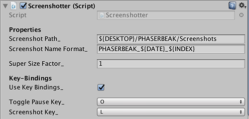
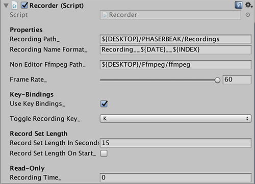

# DTMediaCapture
Simple scripts that capture screenshots and videos.

### Screenshots
Uses Application.CaptureScreenshot to save a screenshot. To use:

1. Add the Screenshotter script to your scene.
2. (optional) Configure where the screenshots are saved.
3. Press the capture screenshot button ('L' by default) when game is running.

To super-sample the current screen, change the superSizeFactor_.

### Videos
Uses Time.captureFramerate to render out smooth captures. Combines frames into video with included ffmpeg executable (windows-untested).

1. Add the Recorder script to your scene.
2. (optional) Configure where the recordings are saved.
3. Press the toggle recording button to start recording ('K' by default) when game is running.
4. Press the toggle recording button again when finished recording.

To record video in a standalone build, make a copy of included ffmpeg and place it the "Non Editor Ffmpeg Path".

You can see how much time has been recorded through the "Recording Time_" variable.

